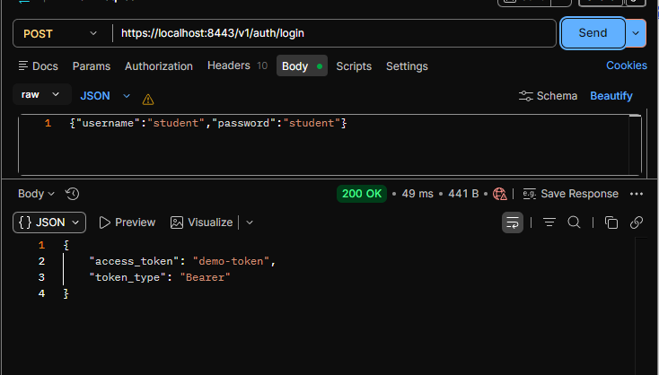
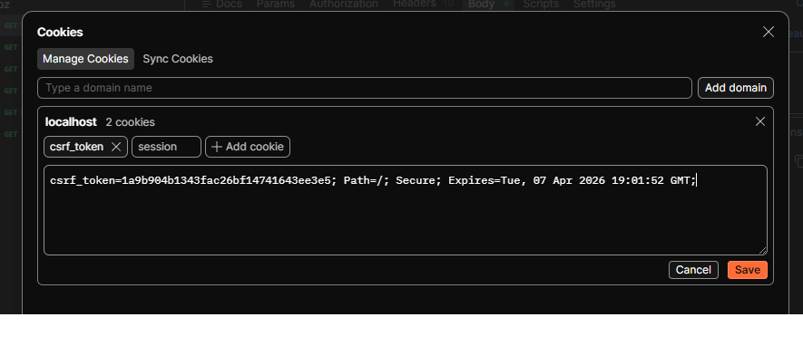
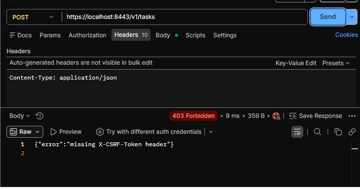
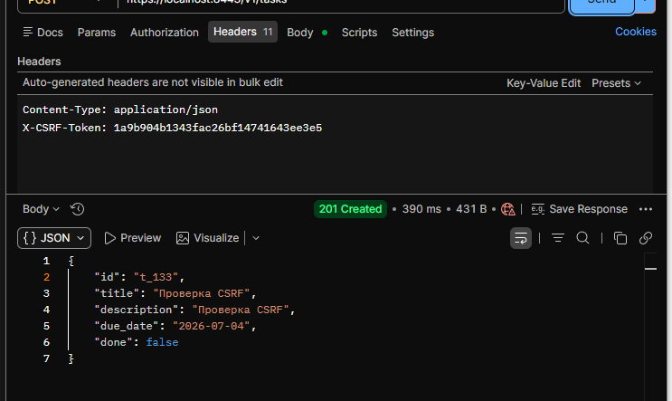
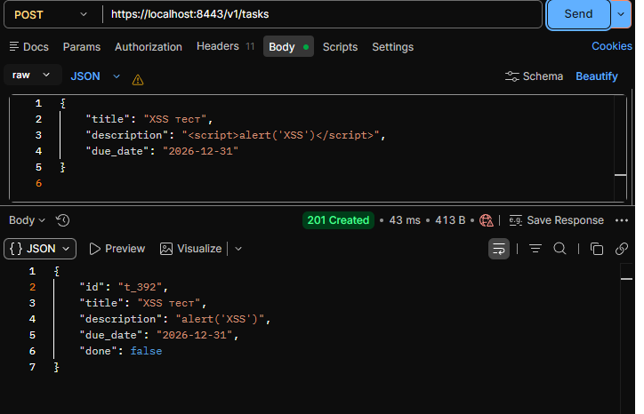

# Практика 6
## Выполнил: Студент ЭФМО-02-25 Фомичев Александр Сергеевич
### Структура:
```
deploy
    monitoring
        prometheus.yml
        docker-compose.yml
    tls
        docker-compose.yml
        nginx.conf
        init.sql
        cert.pem
        key.pem 
services 
    auth
        Dockerfile
        cmd
            auth
                main.go
        internal
            grpc
                server.go
            http
                handlers
                    login.go
                    verify.go
                routes.go
            service
                auth.go
    tasks
        Dpkerfile
        cmd
            tasks
                main.go
        internal
            metrics
                metrics.go
            grpcclient
                client.go
            http
                middleware
                    csrf.go
                    metrics.go
                handlers
                    tasks.go
                    middleware
                        auth.go
                routes.go
            service
                tasks.go
shared
    shared
        logger
            logger.go 
    middleware
        security.go
        requestid.go
        accesslog.go
        grpclog.go
    httpx
        client.go
pkg
    api
        auth
            v1
                auth.proto
                auth.pb.go
                auth_grpc.pb.go
docs
    pz17_api.md
README.md
go.mod
go.sum
```
## Какие cookies используются и какие флаги установлены.

1)cookies: session, со значением: demo-token, с флагами: HttpOnly, Secure, SameSite=Lax, Path=/, MaxAge=3600
2)cookies: csrf_token, со значением	случайная строка (hex, 16 байт), с флагами:	Secure, SameSite=Lax, Path=/, MaxAge=3600 (без HttpOnly)

## Какой CSRF подход выбран и как он работает.

выбран подход Double Submit Cookie

**Принцип:**

1)Клиент получает csrf_token в cookie при логине.
2)Для всех state-changing запросов (POST, PATCH, DELETE) клиент обязан добавить заголовок X-CSRF-Token с тем же значением, что и в cookie.
3)Сервер (Tasks service) сравнивает значение из cookie и заголовка. Если не совпадают или отсутствуют → 403 Forbidden.

**Реализация:**

Добавлен middleware CSRFMiddleware в services/tasks/internal/http/middleware/csrf.go.
В routes.go все опасные методы обёрнуты этим middleware.

## Примеры запросов:

**login**

****

**cookies**

****

**POST без CSRF (403)**

****

**POST с CSRF (201/200)**

****

## Что сделано для XSS.
**1) Санитизация пользовательского ввода:**

В CreateTaskHandler и UpdateTaskHandler поле description очищается от HTML-тегов с помощью регулярного выражения (удаляются все <>-теги).

Функция sanitizeString использует regexp.MustCompile(\<[^>]*\>).

**2) Заголовки безопасности**

Добавлен middleware SecurityHeadersMiddleware (в shared/middleware/security.go), который устанавливает:

1) X-Content-Type-Options: nosniff
2) X-Frame-Options: DENY
3) Content-Security-Policy: default-src 'self'

**пример**

****


## Инструкция запуска.

**Запуск всей системы**

```
cd deploy/tls
docker-compose up -d --build
```

